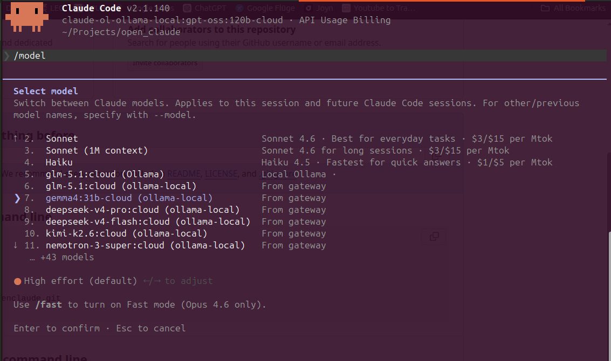

# openclaude
A tiny multi-provider router for **Claude Code** that lets you use **Ollama** (local & cloud) models inside the same Claude Code session as your normal **Anthropic Claude** subscription.

## Commands

| Command                       | What it does                                                |
| ----------------------------- | ----------------------------------------------------------- |
| `oc start`                    | Boot router (if needed); exec `claude` with router env set. |
| `oc start --bridge=aggressive`| Also bind Sonnet+Opus picker slots to Ollama (3 slots vs 1).|
| `oc start --no-discovery`     | Don't set the AUTH_TOKEN sentinel; alias slots only.        |
| `oc stop`                     | Shut down the router daemon.                                |
| `oc status`                   | Show daemon state + configured providers.                   |
| `oc list`                     | List installed Ollama models with paste-ready /model lines. |
| `oc model-subagent`           | Show/select subagent model for Claude Code.                 |
| `oc model-subagent <n>`       | Set subagent model by number (takes effect on next start).  |



- **Subscription auth preserved** — the router forwards Claude Code's OAuth bearer to `api.anthropic.com` untouched. No `ANTHROPIC_API_KEY` required.
- **All your Ollama models show up in `/model`** — pick them like any other model.
- **Ollama Cloud built-in** — run frontier open-weight models (`gpt-oss:120b`, `qwen3:480b`, `deepseek-v3.1:671b`, `kimi-k2:1t`, etc.) on Ollama's hosted infra without a local GPU. Same `/model` picker, same workflow.
- **Thin proxy** — whatever model name Claude Code sends, the router parses `provider:modelId` and dispatches.

## How it works

```
┌──────────────┐  ANTHROPIC_BASE_URL      ┌────────────────────┐
│ claude (CLI) │ ────────────────────────►│ openclaude router  │
│  /model      │  Authorization passed    │  127.0.0.1:11436   │
└──────────────┘  through                 └─────────┬──────────┘
                                                    │ parse "provider:modelId"
                                  ┌─────────────────┼─────────────────┐
                                  ▼                 ▼                 ▼
                       api.anthropic.com    localhost:11434      ollama.com
                       (your OAuth)         (no auth)            (x-api-key)
```

When you select a model in `/model`:
- Picker entry **`Default` / `Sonnet` / `Opus` / `Haiku`** → routed to **real Anthropic** via your subscription.
- Picker entries **`<ollama-name> (ollama-local)`** (auto-discovered from your Ollama install) → routed to **local Ollama**.
- Picker entry **`<name> (Ollama)`** (the Custom alias slot) → routed to **local Ollama**.
- Anything you type, e.g. `/model ollama-local:gemma4:31b-cloud` → routed by parsing the prefix.

### Discovery mode (default ON)

To get **all** your Ollama models in the picker, openclaude sets `ANTHROPIC_AUTH_TOKEN` to a sentinel before launching `claude`. This makes Claude Code trigger gateway model discovery — Claude Code calls `GET /v1/models` on our router and the router enumerates every installed Ollama model.

For inference, the router intercepts the sentinel token in the `Authorization` header and substitutes the **live OAuth bearer** read from `~/.claude/.credentials.json` (re-read on every request, so token rotation is handled). Your subscription still pays for Anthropic-bound traffic.

**Side-effect of setting `ANTHROPIC_AUTH_TOKEN`** (per Claude Code's own changelog): the following are **disabled** for the session — Remote Control, `/schedule`, claude.ai MCP connectors, notification preferences. Subscription inference and everything else is unaffected.

Pass `oc start --no-discovery` to skip the sentinel: only the env-var-bound alias slots will appear in the picker, and OAuth flows untouched.

## Prerequisites

Install these first — openclaude is a router, not a replacement:

- **Claude Code ≥ v2.1.129** — [claude.com/claude-code](https://claude.com/claude-code). The `claude` CLI must already be on your `PATH` and logged in (run `claude` once and complete the OAuth flow). `oc start` execs `claude` directly; if it's missing you'll see `failed to exec "claude": ENOENT`.
- **Node.js ≥ 20** — [nodejs.org](https://nodejs.org). openclaude uses Node 20+ APIs (`fetch`, `ReadableStream`, `AbortSignal.timeout`).
- **Ollama** — [ollama.com/download](https://ollama.com/download). Only required if you want to route to local or cloud Ollama models. Without Ollama, openclaude still works as a pure pass-through to api.anthropic.com, but there's nothing extra it adds in that mode.

Quick check:

```bash
claude --version    # should print v2.1.129 or newer
node --version      # should print v20.x or newer
ollama --version    # optional, only if you want Ollama models
```

## Install

The recommended way works on every platform — clone, then `npm link` to register `openclaude` / `oc` globally:

```bash
git clone <this-repo> openclaude
cd openclaude
npm link        # registers `openclaude` and `oc` on your PATH via npm's shim
```

`npm link` works because `package.json` declares both bin names. On Windows it produces `.cmd` shims; on Unix it symlinks into your global `bin` directory. Either way, `oc start` works from any cwd.

### Platform-specific notes

**Linux** — if you prefer a manual symlink over `npm link`:

```bash
git clone <this-repo> ~/.openclaude/repo
mkdir -p ~/.local/bin
ln -s ~/.openclaude/repo/bin/openclaude ~/.local/bin/oc
# make sure ~/.local/bin is on $PATH
```

**macOS** — `npm link` is the path of least resistance. Manual install also works, but the symlink destination differs by setup:

```bash
git clone <this-repo> ~/.openclaude/repo
# Apple Silicon (Homebrew):
ln -s ~/.openclaude/repo/bin/openclaude /opt/homebrew/bin/oc
# Intel Macs:
ln -s ~/.openclaude/repo/bin/openclaude /usr/local/bin/oc
```

If you installed Node via `nvm`, `npm link` will land the shim in the active nvm-managed `bin` directory automatically.

**Windows** — use `npm link` from PowerShell or `cmd.exe`. Manual symlinks need admin privileges or Developer Mode, so they're not recommended. The credentials file path is `%USERPROFILE%\.claude\.credentials.json` and the config lives at `%USERPROFILE%\.openclaude\config.json`. Everything else is path-agnostic.

> The daemon writes its pid/log/config under `~/.openclaude/` (or `%USERPROFILE%\.openclaude\` on Windows). Override with `OPENCLAUDE_HOME=/some/path` if you need a different location.

## Quickstart

```bash
# 0. Make sure Ollama is running and you have at least one model installed
ollama serve &
ollama pull qwen2.5-coder
ollama list             # confirm

# 1. Boot the router and exec into Claude Code
oc start

# Output will look like:
#   [openclaude] router on http://127.0.0.1:11436
#   [openclaude] found 3 Ollama model(s):
#     - qwen2.5-coder:7b
#     - gemma4:31b-cloud
#     - llama3.2:3b
#   [openclaude] mode: conservative (safe) · discovery: ON (all Ollama models in /model)
#   [openclaude] /model picker bindings (friendly names):
#     (Custom) → qwen2.5-coder:7b
#     Default + Sonnet + Opus + Haiku → real Anthropic via your subscription
```

Then inside Claude Code:
```
/model
# pick any Ollama entry (auto-discovered) or the (Custom) slot
# or paste a raw "/model ollama-local:<name>" command
```


## Subagent model

Claude Code's Explore, Plan, and general-purpose subagents can be expensive because they read many files and digest verbose output. `oc model-subagent` lets you redirect subagent traffic to a cheaper model (like a local Ollama model) while keeping your main conversation on Anthropic Claude.

**How it works:** `oc model-subagent` writes a `subagentModel` key to `~/.openclaude/config.json`. When you next run `oc start`, the router sets `CLAUDE_CODE_SUBAGENT_MODEL` in the environment before launching `claude`. Claude Code reads this variable once at startup, so **changes do not take effect in a running session** — you must restart `oc` to apply them.

```bash
# Show current setting and available models
oc model-subagent

# Select a model by number
oc model-subagent 2

# Reset to Anthropic default
oc model-subagent 0
# or
oc model-subagent default
```

The numbered menu includes:
- **0** — default (Anthropic), unsets the override
- **1..N** — installed Ollama models, routed as `ollama-local:<name>`
- **Anthropic models** (e.g. Haiku) — noted as using your subscription

If the configured model is no longer installed when you run `oc start`, the router falls back to the Anthropic default and prints a warning.

`oc status` shows both the configured value and the value active in the current session, flagging any pending change.

## Bridge modes for the alias slots

Even with discovery on, openclaude can also rebind Claude Code's built-in alias slots (Custom / Sonnet / Opus) to specific Ollama models so they get **friendly display names** in the picker. Aliases are filled from your Ollama list in order.

| Mode                       | What it does                                                                                       | Anthropic aliases lost                |
| -------------------------- | -------------------------------------------------------------------------------------------------- | ------------------------------------- |
| **conservative** (default) | Bind the **Custom** slot to your first Ollama model.                                               | none                                  |
| **aggressive**             | Also bind **Sonnet** and **Opus** alias slots to your next two Ollama models.                      | Sonnet, Opus                          |

> **🚫 Haiku is never bridged**, in either mode. Claude Code uses the `haiku` alias for its background safety classifier, title generation, and summarization. Routing those to Ollama makes Bash and other tools fail with `"default is temporarily unavailable"`.

## Ollama setup

### Local Ollama (`ollama serve`)

The default config assumes Ollama at `http://127.0.0.1:11434`. Since v0.14, Ollama serves the Anthropic Messages API at `/v1/messages` natively, so no translation layer is needed.

```bash
ollama serve &           # if not already running
ollama pull qwen2.5-coder
oc list                  # confirm openclaude sees it
```

### Ollama Cloud (hosted at ollama.com) — run huge models without a GPU

[Ollama Cloud](https://ollama.com/cloud) hosts large open-weight models (200B–1T parameters) and serves them through the same Anthropic-compatible `/v1/messages` endpoint as local Ollama. That means openclaude routes to it identically — pick a cloud model from `/model` and the request goes to ollama.com instead of `localhost:11434`.

**Why this matters:** you can mix your Anthropic Claude subscription with frontier OSS models like `gpt-oss:120b-cloud`, `qwen3:480b-cloud`, `deepseek-v3.1:671b-cloud`, `kimi-k2:1t-cloud`, or `llama4:scout-cloud` — none of which fit on consumer hardware — without leaving Claude Code or paying per-token Anthropic rates for that traffic.

Two ways to use cloud models, depending on whether you have them pulled locally:

**Option A — pulled into your local Ollama (most common).** When you `ollama pull gpt-oss:120b-cloud`, Ollama registers the cloud model in your local model list (it's served by Ollama's cloud, the local daemon just acts as proxy). They show up automatically in `/model` via discovery and route through `ollama-local`:

```bash
ollama pull gpt-oss:120b-cloud
ollama pull qwen3:480b-cloud
oc start
# /model now lists them as ollama-local entries
```

**Option B — direct to `ollama.com`.** If you'd rather hit `ollama.com` directly without registering models locally:

```bash
export OLLAMA_API_KEY=<your-key-from-ollama.com>
oc start
# In /model: paste "/model ollama-cloud:<name>"
```

The default config has `ollama-cloud` configured with `apiKey: "$OLLAMA_API_KEY"`. The router substitutes the env var at request time.

Get an API key at [ollama.com](https://ollama.com/cloud).

### Adding more providers

Edit `~/.openclaude/config.json`:

```json
{
  "port": 11436,
  "defaultProvider": "claude",
  "providers": {
    "claude":       { "type": "anthropic-passthrough", "baseUrl": "https://api.anthropic.com" },
    "ollama-local": { "type": "ollama", "baseUrl": "http://127.0.0.1:11434" },
    "ollama-cloud": { "type": "ollama", "baseUrl": "https://ollama.com", "apiKey": "$OLLAMA_API_KEY" },
    "remote-ollama":{ "type": "ollama", "baseUrl": "http://192.168.1.50:11434" }
  }
}
```

Edits are picked up on the next request — no daemon restart needed.

## Auth model

| Provider type           | Auth                                                                         |
| ----------------------- | ---------------------------------------------------------------------------- |
| `anthropic-passthrough` | Claude Code's `Authorization` header is forwarded untouched. No key needed.  |
| `ollama` (local)        | None — Ollama ignores the key.                                               |
| `ollama` (cloud)        | `x-api-key: $OLLAMA_API_KEY` (env-var-interpolated).                         |

## Tests

```bash
npm test
```

Six suites:
- `test/router-routing.test.js` — `parseModelTarget` resolves `provider:modelId` correctly, picks the right default, handles colons in model names.
- `test/router-e2e.test.js` — boots the real router against a stub upstream; verifies Anthropic OAuth pass-through, Ollama dispatch with `x-api-key`, no header leakage between providers, HEAD reachability probe, and `claude-ol-` discovery-prefix decoding.
- `test/stream-fixup.test.js` — SSE sanitizer: orphan deltas synthesize starts (text, thinking, tool_use), orphan stops dropped, message_stop auto-closes open blocks, well-formed streams pass through unchanged, chunk-boundary buffering correct.
- `test/capabilities.test.js` — image stripping for text-only models, including nested images inside tool_result blocks.
- `test/sanitize.test.js` — tool_use id rewriting + matching tool_result.tool_use_id remapping, multi-turn coherence, length cap; plus thinking-block signature validation (drop fakes, preserve real Anthropic signatures).
- `test/model-subagent.test.js` — `resolveSubagentModel` validation (installed/missing Ollama models, Anthropic model passthrough), config round-trip (write/read `subagentModel`), default selection removes the key.

## Conversation-history sanitization

Cross-provider sessions accumulate metadata that the *next* provider can't validate. Two known cases, both fixed unconditionally on every outgoing request:

1. **Tool-use ids.** Anthropic requires `tool_use.id` to match `^[a-zA-Z0-9_-]+$`. Ollama's compat layer can emit ids with `.`, `:`, or `#`. Claude Code stores those in history and replays them — so when you switch back to a Claude model, Anthropic returns `400 messages.N.content.M.tool_use.id: String should match pattern ...`. The router rewrites dirty ids to `toolu_oc_<sanitized>` form and remaps the matching `tool_result.tool_use_id` so the call/result graph stays coherent.

2. **Thinking-block signatures.** Anthropic cryptographically signs every `thinking` block it emits and validates the signature on replay. Non-Anthropic upstreams (Ollama, our stream-fixup synthesizer) emit thinking blocks with empty or placeholder signatures, which Anthropic later rejects with `400 messages.N.content.M: Invalid signature in thinking block`. The router scans for thinking blocks whose signature looks fake (missing or shorter than ~64 chars) and replaces them with a `[thinking from a prior model omitted]` text marker. Real Anthropic signatures (long opaque strings) are preserved untouched.

Log lines confirm when either fires: `sanitized N dirty tool_use id(s)` / `dropped N thinking block(s) with non-Anthropic signature`.

## Image-stripping for text-only models

Claude Code re-sends the full conversation history every turn, so an image you attached three turns ago is still in the request when you switch to a text-only model like `deepseek-v4-pro:cloud` or `gpt-oss:120b-cloud`. Without intervention, that model returns 400 `"this model does not support image input"` and you can't continue the conversation.

The router probes each Ollama model's capabilities via `/api/show` (cached in-process), and for models that don't list `vision` in their capabilities, strips `image` content blocks from the request — replacing them with a `[image omitted]` text marker. Vision-capable models are unaffected. Tool-result blocks containing nested images are handled too.

A startup line `[openclaude] stripped N image block(s) for text-only model X` confirms when this fires.

## SSE stream sanitizer

Ollama's Anthropic-compat layer occasionally emits a `content_block_delta` event for an index it never opened with `content_block_start` — Claude Code's stream parser then aborts with `"Content block not found"` and retries forever. This affects multimodal models like `kimi-k2.6:cloud` when handling images and tool calls.

The router wraps every Ollama streaming response in a sanitizer (`src/router/stream-fixup.js`) that:

- Tracks which content-block indices the upstream has opened
- When an orphan `content_block_delta` arrives, synthesizes the missing `content_block_start` (matching the delta's type — text, thinking, or tool_use with placeholder id) and emits it before forwarding the delta
- Tracks `content_block_stop` so a re-used index re-synthesizes properly
- Passes everything else through byte-for-byte

Anthropic-passthrough responses (real Claude) are never touched — the sanitizer only runs for `ollama`-typed providers.

## Limitations

- **`tool_choice` forcing isn't supported** by Ollama's Anthropic-compat layer; some models may degrade tool-use behavior.
- **Synthesized `tool_use` blocks** (when an orphan `input_json_delta` arrives without a preceding start) get a placeholder `id` and `name: "unknown"` — the tool call still executes parser-side but downstream tool routing may fail. Vision/text deltas have no such caveat.
- The router only supports `anthropic-passthrough` and `ollama` provider types in v1. OpenAI / OpenRouter / Bedrock / Vertex are deferred (the abstraction is ready).
- **Discovery mode disables Remote Control / /schedule / claude.ai MCP / notification prefs** for the session (Claude Code requirement). Use `--no-discovery` to keep them, at the cost of seeing fewer Ollama models in the picker.

## Status

v0.2 — single-file Node.js ESM, no build step. ~600 LoC across router + CLI.
